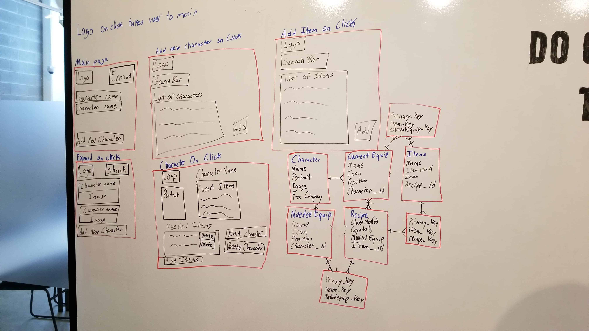

#Description

As an MMO player, I know how hard it is to keep track of what you want and how to get it. This is the first version of the solution to that problem. Import your character from the Final Fantasy XIV API (currently only Malboro) and import your Gear, then start adding what you want to get to your tracker at the bottom of the page. This will be updated more as I go along.

#App

https://final-fantasy-project.herokuapp.com/

#Trello

https://trello.com/b/tZVNBuBJ/final-fantasy-14-equipment

#wireframe/Models

#Libraries/Tech

Bootstrap

Axios

Fetch

React

React-Router-Dom

React-Scripts

Rest-Framework

Django

#Version 2-3-4-???

I want to keep working on this as I go to get it to the vision I originally had. I want to be able to search multiple servers for characters, pull entire Free Company character lists, search for the items within the XIV database and give more detailed stats. I also want to be able to pull recpies on how to make said items. I want to stylize more as I go along, but the rest of this comes first. I also want to add the ability to disable the import Weapons button if the character was not imported.

#Shoutouts

The entire class. We made it! Everyone in the room worked incredibly hard to get to where they are now. Look back at your first project and see how far you've come. You're a dev now, be proud!

#Example Imports

Don't know what characters to import? Here's some example names of characters within Malboro's server! (Used with permission from character owners)

Lucien Walker

Deya Nellaure

Atlani Altham

Lunarua Altham

Hisada Aurum

Kitsu Aiomi

Chris Saikyo

Yuri Tatsuya

Keiko Tatsuya